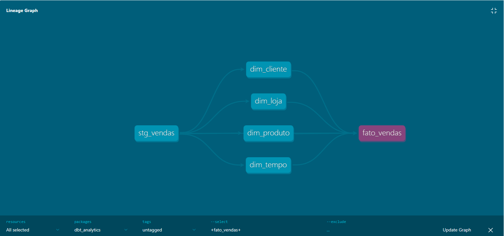

# 🛒 Pipeline Analytics Engineering End-to-End

Projeto de pipeline de dados End-to-End utilizando Python para ingestão e processamento de dados, arquitetura Medallion para organização das camadas analíticas, dbt para transformação e modelagem dimensional (Star Schema), SQL Server como Data Warehouse e Power BI para construção de dashboards e análise de métricas de negócio.

---

## 📋 Descrição

Script que realiza o processo completo de ETL a partir de um dataset fictício de vendas em formato CSV, aplicando tratamentos e padronizações nos dados antes de carregá-los em um banco relacional e posteriormente gerar insights com dashboard no Power BI.

---

## 🏗️ Arquitetura

```
   RAW / CSV            → Arquivo bruto de vendas utilizado como origem dos dados
        ↓
   Extract              → Leitura do arquivo CSV utilizando Pandas
        ↓
   RAW Layer            → Armazenamento dos dados brutos sem transformação
        ↓
   Transform            → Limpeza, padronização e tratamento inicial dos dados
        ↓
   Silver Layer         → Dados confiáveis salvos em formato Parquet
        ↓
   Load                 → Carga dos dados tratados no SQL Server via SQLAlchemy
        ↓
   SQL Server           → Camada persistida para consumo analítico
        ↓
   dbt Staging          → Padronização semântica e preparação analítica
        ↓
   dbt Marts            → Modelagem dimensional com tabelas fato e dimensão
        ↓
   Star Schema          → Estrutura analítica otimizada para consultas e BI
        ↓
   Power BI             → Dashboards, KPIs e geração de insights
```

---

## 🔧 Transformações aplicadas

- Remoção de colunas desnecessárias
- Remoção de duplicatas com base no `ID_Pedido`
- Conversão e padronização da coluna `Data`
- Preenchimento de valores nulos na coluna `Loja` com `"Online"`
- Padronização dos nomes das lojas (capitalização e remoção de espaços)
- Remoção de aspas desnecessárias na coluna `Produto`

---

## 📊 Dashboard (Power BI)

Os dados processados pelo pipeline são consumidos no Power BI para criação de dashboards analíticos.

KPIs desenvolvidos:

 - Faturamento total
 - Total de pedidos
 - Ticket médio

Visualizações:
 - Faturamento por mês
 - Faturamento por loja
 - Faturamento por produto


### 📈 Insights gerados
 - A loja de Salvador apresentou o maior volume de vendas, enquanto a loja Online teve o menor desempenho no período analisado
 - O produto mais vendido foi o iPhone 14, enquanto o cabo HDMI apresentou menor demanda
 - O faturamento total do período foi de aproximadamente R$ 299,4 mi
 - Foram registrados cerca de 100 mil pedidos, com ticket médio de aproximadamente R$ 2,99 mil
 - Outubro foi o mês com maior volume de vendas, enquanto fevereiro apresentou o menor desempenho

---

## ⭐ Star Schema



## 🗂️ Estrutura do projeto

```
Data_Pipeline_Vendas/
│
├── data/
│   ├── raw/
│   │   └── vendas_tech.csv
│   │
│   ├── silver/
│       └── data_clean.parquet
│   
├── dbt_analytics/
│   │
│   ├── models/
│   │   │
│   │   ├── staging/
│   │   │   └── stg_vendas.sql
│   │   │
│   │   └── marts/
│   │       ├── dim_cliente.sql
│   │       ├── dim_produto.sql
│   │       ├── dim_loja.sql
│   │       ├── dim_tempo.sql
│   │       └── fato_vendas.sql
│   │
│   ├── macros/
│   ├── tests/
│   ├── seeds/
│   ├── snapshots/
│   ├── analyses/
│   │
│   ├── dbt_project.yml
│   ├── packages.yml
│   └── README.md
│
├── docs/
│   └── images/
│       └── dashboard_powerbi.png
│
├── src/
│   ├── utils/
│   │   └── logger.py
│   │
│   ├── extract.py
│   ├── transform.py
│   ├── load.py
│   └── pipeline.py
│
├── logs/
│   └── pipeline.log
│
├── .env
├── .env.example
├── .gitignore
└── README.md
---

## ⚙️ Como executar

# 1. Clonar o repositório
```
git clone <https://github.com/felipesardinha19/python-etl-sqlserver>
```

# 2. Instalar dependências
```
pip install pandas sqlalchemy pyodbc python-dotenv
```

# 3. Configurar variáveis de ambiente
```
cp .env.example .env
```

# 4. Executar pipeline
```
python -m src.pipeline
```

---

## 🛠️ Tecnologias utilizadas

- Python 3.12
- Pandas
- DBT (Data Build Tools)
- SQLAlchemy
- SQL Server Express
- Power BI
- python-dotenv
